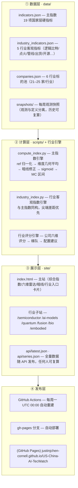

# 🇺🇸🇨🇳 US-China AI Competition Tracker

> **数据驱动 · 可复算 · 自动更新** 的中美 AI 全维竞争监测平台 —— 主综合指数（双核六维 + 五条暗线）+ **六大硬科技行业专项**，一键发布 GitHub Pages。

[](https://justinjchen-cornell.github.io/US-China-AI-TecWatch/)
[](https://github.com/Justinjchen-Cornell/US-China-AI-TecWatch/actions)
[](https://github.com/Justinjchen-Cornell/US-China-AI-TecWatch/tree/main)
[](https://github.com/Justinjchen-Cornell/US-China-AI-TecWatch/blob/main/scripts/compute_index.py)
[]()

---

## 指数格局（2026Q2 快照）


> 口径说明：行业指数均采用**国家层客观硬指标**（尖端差距优先），与"公司池平均分"严格区分；>50 表示中国相对有利，<50 表示中国仍处追赶位。完整口径见 [方法论](#方法论)。

## 平台架构



## 方法论

平台分**两层**，各司其职、口径分离：

### 第一层 · 主综合指数 AICompete Index ∈ [0,100]

把公开报告《中美 AI 全维竞争》中"双核六维耦合"框架翻译为可持续观测的指数：

| 构成 | 说明 |
|---|---|
| **六维** | 能源 · 算力 · 智能 · 生命 · 暴力 · 金融（权重 `[1.0, 1.2, 1.3, 0.9, 1.0, 1.1]`） |
| **五条暗线** | 能源约束 · 战场数据 · 货币分叉 · 开源地缘化 · 人才流向（**数据驱动**：带 `latent` 标签的指标自动推导信号） |
| **归一化** | 每指标绝对校准区间 `ref_min/ref_max`（跨快照稳定）；规模类指标对数缩放 |
| **合成** | 维度几何平均（Laplace 平滑）→ 加权 → sigmoid → Index；`50` 为均势 |
| **不确定性** | 蒙特卡洛 N=2000 → `index_low/index_high`；`confidence` = 加权平均来源可靠度 |

### 第二层 · 行业客观指数（六大硬科技）

半导体 · AI 模型 · 量子计算 · 可控核聚变 · AI 生命科学 · 具身智能

- 每行业 3–5 项**国家层客观硬指标**（如：逻辑量子比特数差距、聚变点火里程碑、AI 药临床管线、人形机器人出货份额、LMArena 顶尖分差）
- 与主指数**同构合成**（ref 归一化 → 几何平均 → sigmoid → MC 区间），口径统一、可复算
- **标的池不参与国家指数**：公司评分仅用于投资标的分析（梯队/配置建议），`pool_avg` 随 API 发布仅作参考

| 行业 | 子站 | 客观指数 | 核心指标（示例） |
|---|---|---|---|
| 半导体 | `/semiconductor` | 44.3 | 设备国产化率 · EUV 获取 · 先进制程 · HBM 份额 |
| AI 模型 | `/ai-models` | 52.9 | 顶尖分差 · 开源份额 · 推理成本比 · 日调用量 |
| 量子计算 | `/quantum` | 43.8 | 逻辑比特差距 · 物理比特 · 专利 · 论文 · 政府投入 |
| 可控核聚变 | `/fusion` | 48.2 | 等离子体维持 · 磁体场强 · 点火里程碑 · 专利 |
| AI 生命科学 | `/bio` | 43.4 | AI 药管线 · 临床占比 · 测序份额 · 模型差距 |
| 具身智能 | `/embodied` | 53.6 | 出货份额 · 灵巧手供应链 · 成本比 · VLA 差距 |

> ⚠️ 口径红线：**绝不把"投资标的数量/池内均分"当作国家竞争指数**——尖端差距靠硬指标一点一点度量。

### 第三层 · 投资标的分析

各行业子站维护 21–25 家海内外标的池：公司六维评分（科学/工程/资本/供应链/政策…）、梯队划分（领跑/跟进/潜力/观察）、配置建议（核心仓 / 期权仓 / 信仰仓）。**定位为标的跟踪工具，与竞争指数严格区分**。

## 目录结构

```
us-china-ai-tracker/
├── README.md / docs/                 # 文档与图表
├── config/weights.json               # 主指数权重（与数据分离）
├── data/
│   ├── indicators.json               # 主指数 19 项指标定义
│   └── snapshots/                    # 每周观测快照（YYYY-MM-DD.json）
├── scripts/
│   ├── compute_index.py              # 主指数引擎（含 MC 不确定性）
│   ├── industry_index.py             # 行业客观指数引擎（通用）
│   ├── update_snapshot.py            # 生成快照
│   └── build_site.py                 # 渲染主站 + 行业入口
├── semiconductor/ · ai-models/ · quantum/ · fusion/ · bio/ · embodied/
│   ├── data/                         # industry_indicators.json + companies.json + snapshots/
│   ├── scripts 或 build_report.py    # 各行业独立引擎
│   └── README.md                     # 各行业研究报告与使用说明
├── site/                             # 构建产物（GitHub Pages 发布目录）
│   ├── index.html                    # 主站
│   └── {industry}/                   # 行业子站（子路由）
└── .github/workflows/update.yml      # 每周自动构建 + 部署
```

## 快速开始

```bash
# 主指数
python scripts/update_snapshot.py          # 生成当期快照
python scripts/compute_index.py --snapshot data/snapshots/2026-08-24.json
python scripts/build_site.py               # 渲染主站

# 行业子站（示例：量子）
python quantum/build_report.py --site-dir ../site/quantum
python scripts/build_site.py               # 重建主站刷新行业卡片
```

打开 `site/index.html` 本地预览；或部署到 GitHub Pages。

## 自动更新

`.github/workflows/update.yml` 每周一 UTC 00:00 自动运行：更新主项目快照 → 全量重建主站与 6 个行业子站 → 提交 → 部署 `gh-pages`。可在仓库 **Actions** 页手动触发（`Run workflow`）。

## 数据与免责声明

数据基线来自公开学术报告与权威研究（Stanford AI Index、ATOM Report、OpenRouter、CIFER、中金研究、WIPO/Nature Index 及行业公开数据），行业指标数值为**公开资料近似整理**（每项标注来源与可靠度）。本项目**仅作趋势研究与学术讨论，不构成任何投资建议**。指标数值随公开数据持续修订，以最新快照为准。
