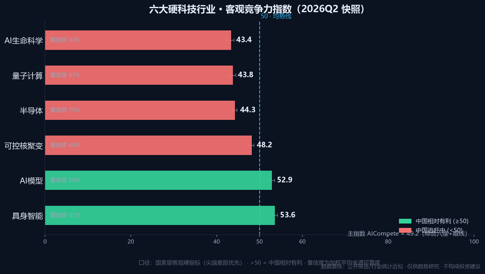
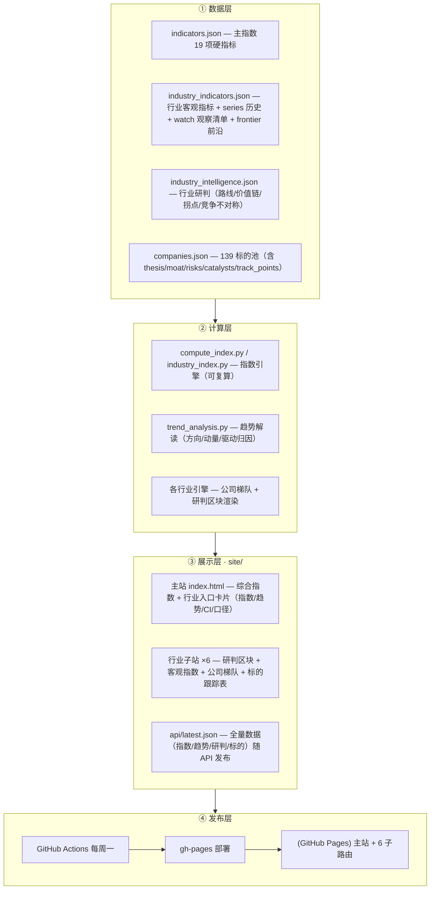

# 🇺🇸🇨🇳 US-China AI Competition Tracker

> **行业研判 · 标的分析 · 趋势追踪** —— 六大硬科技（半导体 · AI模型 · 量子计算 · 可控核聚变 · AI生命科学 · 具身智能）的深度研究平台：客观指数度量竞争位势，行业研判判断方向，139 个标的逐家跟踪。一键发布 GitHub Pages，每周自动更新。

[](https://justinjchen-cornell.github.io/US-China-AI-TecWatch/)
[](https://github.com/Justinjchen-Cornell/US-China-AI-TecWatch/actions)
[](https://github.com/Justinjchen-Cornell/US-China-AI-TecWatch/tree/main)
[](https://github.com/Justinjchen-Cornell/US-China-AI-TecWatch/tree/main)
[]()

---

## 指数格局（2026Q2 快照）



> 行业指数 = **国家层客观硬指标**（尖端差距优先，与"标的池均分"严格区分）。>50 中国相对有利；近两年趋势箭头 = 首尾指数变化。

## 平台架构



## 三层内容体系

> **核心不是比分，是方向与判断。** 指数是度量工具，研判与标的分析才是目的。

### 第一层 · 客观指数（度量位势）

| 指数 | 口径 |
|---|---|
| AICompete 主指数 | 六维（能源/算力/智能/生命/暴力/金融）+ 五条暗线（数据驱动），ref 区间归一化 + sigmoid + MC 区间 |
| 行业指数 ×6 | 每行业 3-5 项国家层硬指标（逻辑比特差距/点火里程碑/临床管线/出货份额/LMArena 分差…），同构合成 |

### 第二层 · 行业研判（判断方向）—— 每行业 `industry_intelligence.json`

- **verdict**：阶段判断 · 中国位置 · 关键拐点 · 投资主题（一句话结论）
- **技术路线全景**：各路线成熟度 · 中美玩家 · 收敛信号
- **价值链判断**：价值集中在哪、卖铲人逻辑
- **竞争不对称**：中美优势区 · 结构性差距 · 不对称性（谁锁定谁）
- **拐点清单**：未来 6-18 个月事件 × 概率 × 影响

### 第三层 · 标的分析（139 家逐家跟踪）—— 每家 5 字段

| 字段 | 含义 |
|---|---|
| thesis | 一句话投资逻辑（为什么值得跟踪） |
| moat | 护城河（什么别人难复制） |
| risks | 主要风险（什么会毁掉逻辑） |
| catalysts | 催化剂（什么会触发重估） |
| track_points | 跟踪点（定期看什么指标/事件验证） |

**覆盖**：半导体 32+12 · AI模型 12 · 量子 24 · 核聚变 21 · 生命科学 25 · 具身 25

## 六大行业专项

| 行业 | 子站 | 指数 | 2年趋势 | 研判要点（verdict） |
|---|---|---|---|---|
| 半导体 | `/semiconductor` | 44.3 | — | 制裁博弈深化期：设备国产替代（卖铲人）确定性最高，HBM 弹性最大 |
| AI模型 | `/ai-models` | 52.9 | ▲+7.8 | 生态领先尖端未超越：通用底座巨头化，垂直/开源/推理基建是价值落点 |
| 量子计算 | `/quantum` | 43.8 | ▲+3.2 | 纠错过渡期：先投卖铲人（激光/制冷/测控），整机作期权 |
| 可控核聚变 | `/fusion` | 48.2 | ▲+3.8 | 工程化爬坡：稳态纪录领先但点火落后，BEST 2027 是节点 |
| AI生命科学 | `/bio` | 43.4 | ▲+3.6 | 临床验证期：首个 AI 药获批（不论中美）将重置估值锚 |
| 具身智能 | `/embodied` | 53.6 | ▲+6.8 | 量产元年兑现期：价值向脑与手集中，整机厂化趋势下卖铲人最确定 |

## 方法论底稿

> 📘 **[docs/methodology.md](docs/methodology.md)** —— 项目思想母体与研究基准：双核体系 · 六维耦合 · 五条暗线 · 终局判断 + 六大行业细研（技术路线/竞争格局/价值链/关键拐点/标的逻辑/跟踪信号）+ 决策框架。

## 目录结构

```
us-china-ai-tracker/
├── README.md / docs/
├── config/weights.json               # 主指数权重（与数据分离）
├── data/                             # 主指数指标 + 每周快照
├── scripts/
│   ├── compute_index.py              # 主指数引擎
│   ├── industry_index.py             # 行业客观指数引擎（通用）
│   ├── trend_analysis.py             # 趋势解读（方向/动量/驱动归因）
│   └── build_site.py                 # 主站渲染
├── {semiconductor,ai-models,quantum,fusion,bio,embodied}/
│   ├── data/
│   │   ├── industry_indicators.json  # 客观指标 + series + watch + frontier
│   │   ├── industry_intelligence.json# 行业研判（路线/价值链/拐点）
│   │   └── companies.json            # 标的池（含 5 字段深化研判）
│   ├── build_report.py 或 scripts/   # 各行业引擎
│   └── README.md / REPORT.md         # 行业研究报告（人话版）
├── site/                             # 构建产物（主站 + 6 子路由）
└── .github/workflows/update.yml      # 每周一自动构建部署
```

## 快速开始

```bash
# 全量重建（本地）
python scripts/build_site.py
python semiconductor/scripts/build_site.py --site-dir ../site/semiconductor
python ai-models/build_report.py --site-dir ../site/ai-models
# ... 各行业同理（quantum/fusion/bio/embodied）
python scripts/build_site.py          # 重建主站刷新行业卡片
```

**数据更新**：改 JSON（指标值/研判/标的字段）→ 重跑对应构建 → 提交。代码零改动，任何人可复算。

## 数据与免责声明

- **客观指数**：数据基线来自公开学术报告与权威研究，行业指标为公开资料近似（每项标注来源与可靠度）
- **行业研判与标的分析**：为**作者观点**（子站区块标注"非评分 · 作者观点"），需结合一手产业信息持续校准——`track_points` 与拐点概率请用你自己的研究覆盖
- 本项目仅作趋势研究与学术讨论，**不构成任何投资建议**
